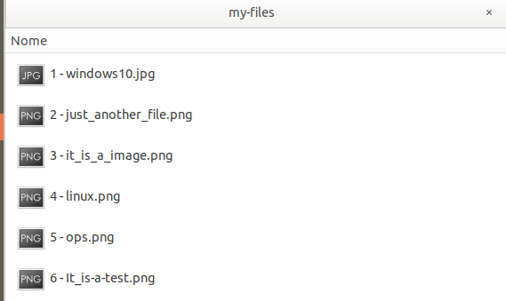

# Rename multiple files

Rename multiple files in a sequence can be a tiring task.
It's a simple code to automatically rename multiple files using:
* PHP or
* Python.

To use the code, you should change the value of variable **path**, where are the files that it will renames.

**php**: `php rename_files.php`
**python**: `python rename_files.py`

## How it works?

The code will rename files putting a number at the beginning of the filename, enumerating of 1 to n (quantity of files on directory).

Example:

In the image below, you see some files with random names, without a sequence.

  

And now the result:

  

